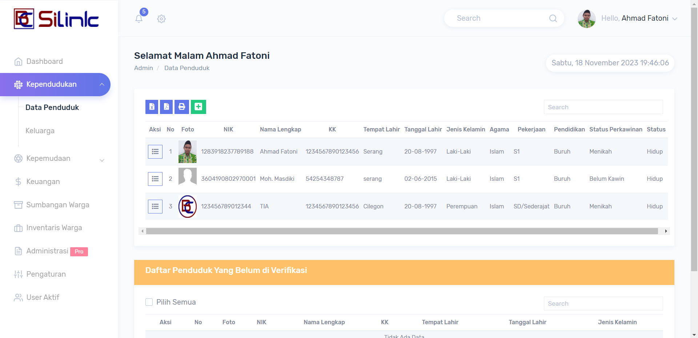

# SILINK - Sistem Informasi Lingkungan

SILINK adalah aplikasi open source yang dikembangkan menggunakan CodeIgniter 3 dan MySQL. Aplikasi ini dirancang untuk mengelola data administrasi lingkungan dengan berbagai fitur yang mencakup aspek beragam seperti keluarga, keuangan, pemuda, penduduk, inventaris warga, dan lainnya. Aplikasi ini memiliki tiga peran akses: Admin, Pemuda, dan Warga.

## Fitur

1. **Dashboard**: Ringkasan visual dari statistik dan informasi penting.
2. **Data Keluarga**: Manajemen data keluarga warga.
3. **Data Keuangan**: Perekaman dan pelacakan data keuangan.
4. **Data Pemuda**: Informasi dan aktivitas pemuda di lingkungan.
5. **Data Penduduk**: Data individu tentang penduduk.
6. **Inventaris Warga**: Pencatatan dan pengelolaan inventaris warga.
7. **Pengaturan Aplikasi**: Konfigurasi dan pengaturan aplikasi.
8. **Register Warga**: Pendaftaran dan manajemen data warga.
9. **Sumbangan Warga**: Penerimaan dan pencatatan sumbangan dari warga.
10. **Daftar Kegiatan dan Tambah Kegiatan**: Pencatatan dan pengelolaan kegiatan di lingkungan.

## Role Akses

1. **Admin**: Akses penuh ke semua fitur aplikasi.
2. **Pemuda**: Akses terbatas sesuai dengan kebutuhan pemuda.
3. **Warga**: Akses terbatas sesuai dengan kebutuhan warga.

## Screenshot

### 1. Dashboard

### 2. Data Keluarga

### 3. Data Keuangan

### 4. Data Pemuda

### 5. Data Penduduk

### 6. Inventaris Warga

### 7. Pengaturan Aplikasi

### 8. Register Warga

### 9. Sumbangan Warga

### 10. Daftar Kegiatan dan Tambah Kegiatan

## Instalasi

1. Clone repositori ini: `git clone https://github.com/inotechno/silink.git`
2. Impor struktur database dari `silink.sql`.
3. Konfigurasi file `application/config/database.php` untuk pengaturan koneksi database.

## Kontribusi

SILINK sangat terbuka terhadap kontribusi. Jika Anda tertarik untuk berkontribusi atau melaporkan masalah, silakan buka issue atau pull request. Kami sangat menghargai setiap bentuk kontribusi.

## Lisensi

Diberikan di bawah lisensi MIT - Lihat [LICENSE](LICENSE) untuk lebih lanjut.
